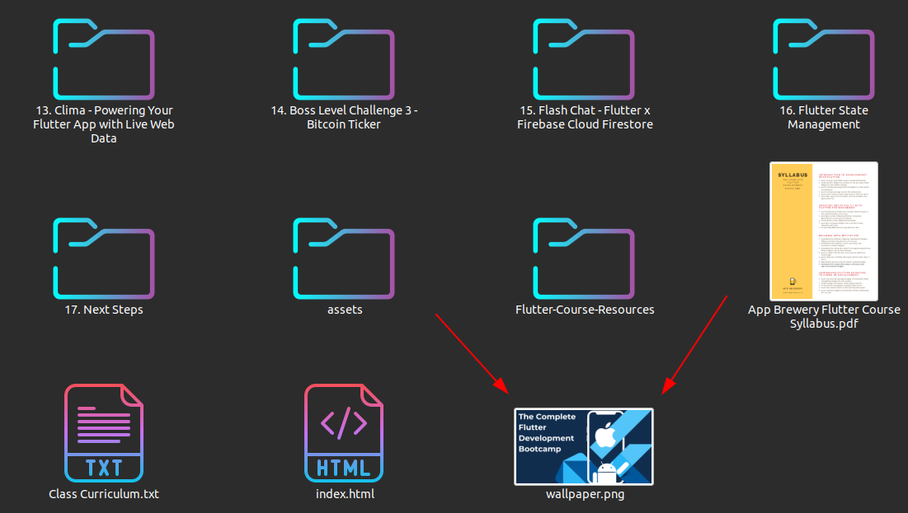
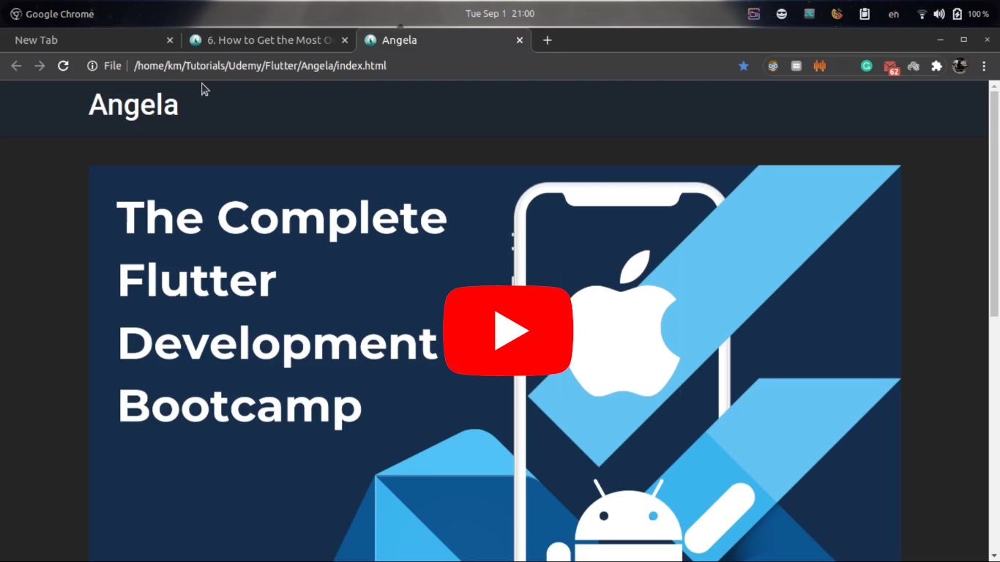
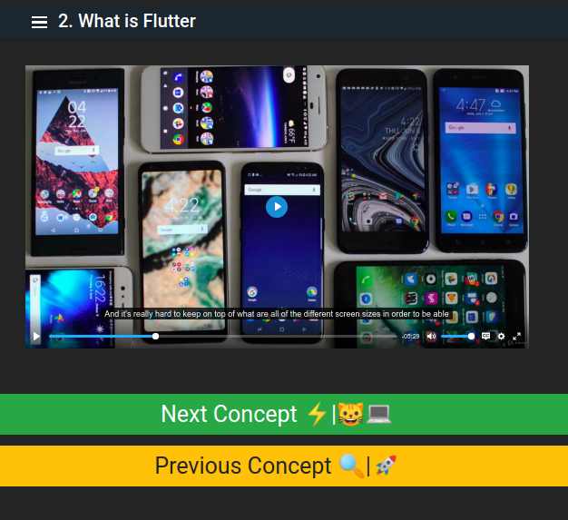
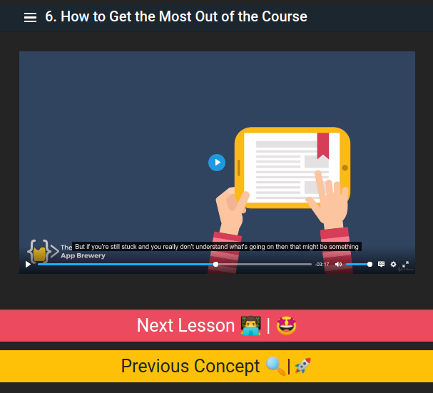
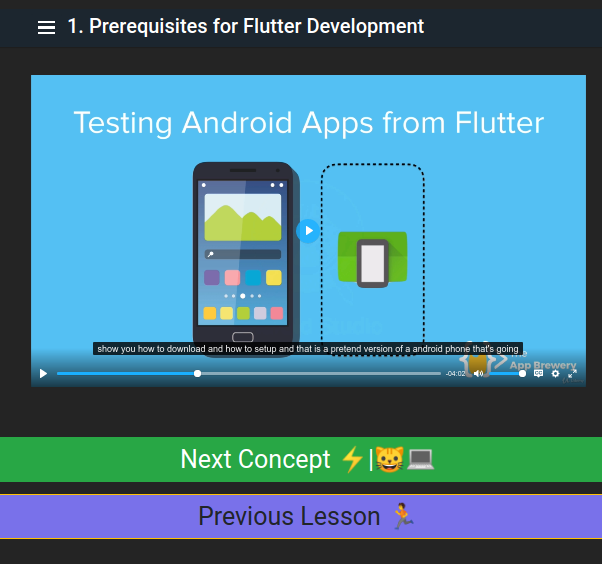

# 🌟 Please star 🌟 this repo if liked it. 
After you download your `Udemy` course using this great tool [@udemy-dl](https://github.com/r0oth3x49/udemy-dl) you can
use my tool to create a local website for your downloaded course

This project was inspired from those great guys [@Udacimak](https://github.com/udacimak/udacimak)

The purpose of this project is to access your `videos`, `subtitles` and `html files` all `in one place` so you can focus only on learning.

# 🌟 Index
[**How To Use It**](#-how-to-use-it-) &nbsp;**|**&nbsp; [**Shortcuts**](#-shortcuts-) &nbsp;**|**&nbsp;
[**The Result**](#the-result-) &nbsp;**|**&nbsp;
[**Problems & Solutions**](#-problems--solutions)

&nbsp;

## 🌟 How To Use It 📓
1. `[OPTIONAL]` set a wallpaper for the course hompage 

The image can have `any name` and these extensions `".jpg", ".gif", ".png", ".tga", "jpeg"`

  

1. Open a terminal

2. Excute this command:

        pip install webvtt-py

3. Excute this command

        python run.py "THE_COURSE_FOLDER_PATH"`

4. Enjoy. 😎

## 🌟 Shortcuts 👨🏼‍💻

- `b` : go to the previous video

- `c` : toggle captions ON/OFF
 
- `f` : Toggle full screen
 
- `h` : go the course home page
 
- `n` : go to the next video
 
- `CTRL + b` : Display/Hide sidebar
 
- `> (SHIFT+.)` : Increase playback rate
 
- `< (SHIFT+,)` : Decrease playback rate

## 🌟 The Result 🤩
### Please see this demo video

### Scereenshots

## 🌟 Problems & Solutions

⁉ `the shortcuts doesn't work?`

Make sure that the selected language in your keyboard is `English`

⁉ `the subtitle is not shown`

This problem beacuse of the `Chrome browser security issues` which doesn't allow subtitles to play and you can overcome it by applying [these 2 simple steps.](./chrome_subtitles.md) 